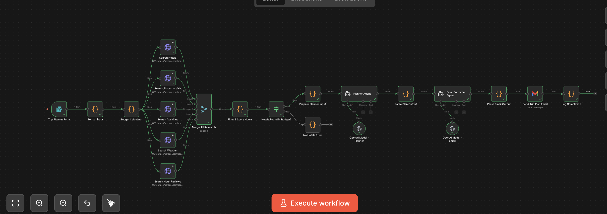
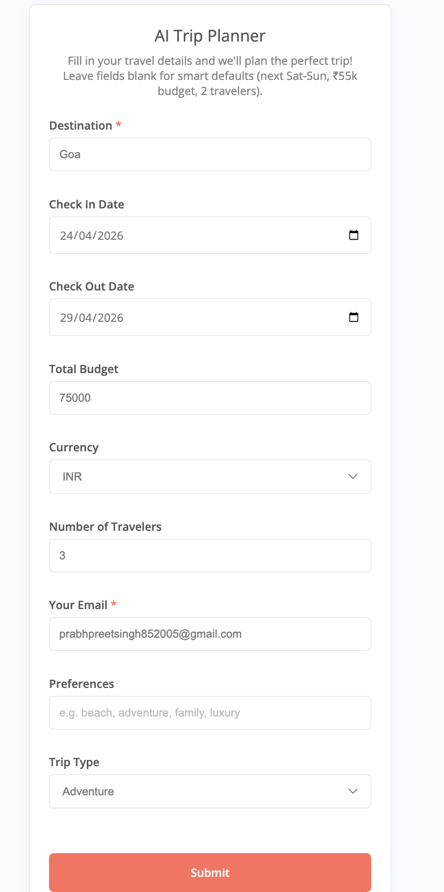
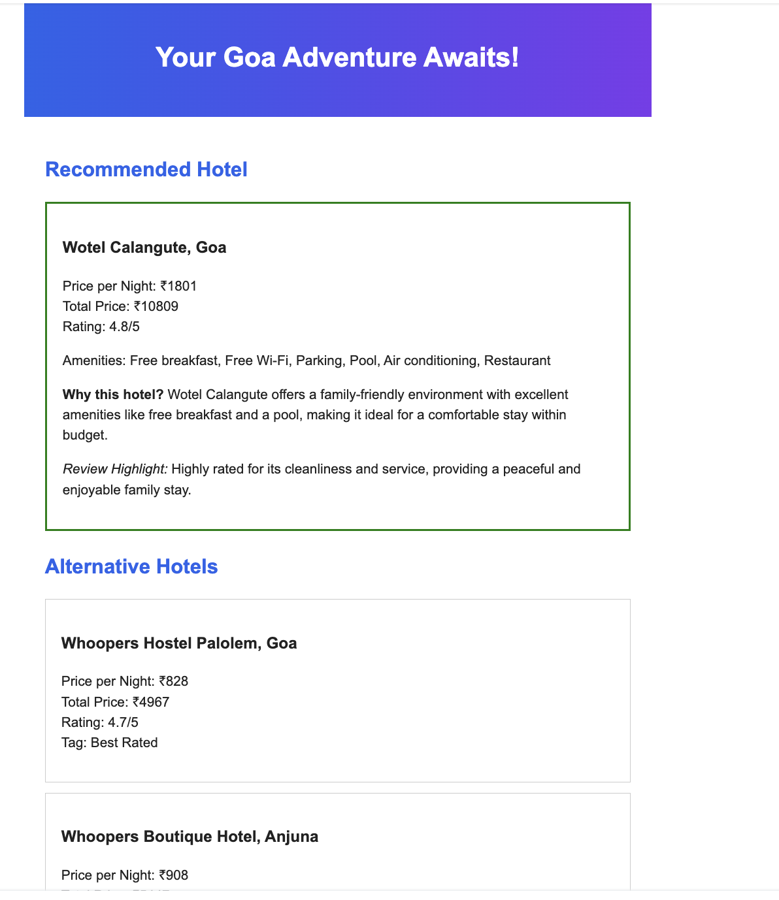
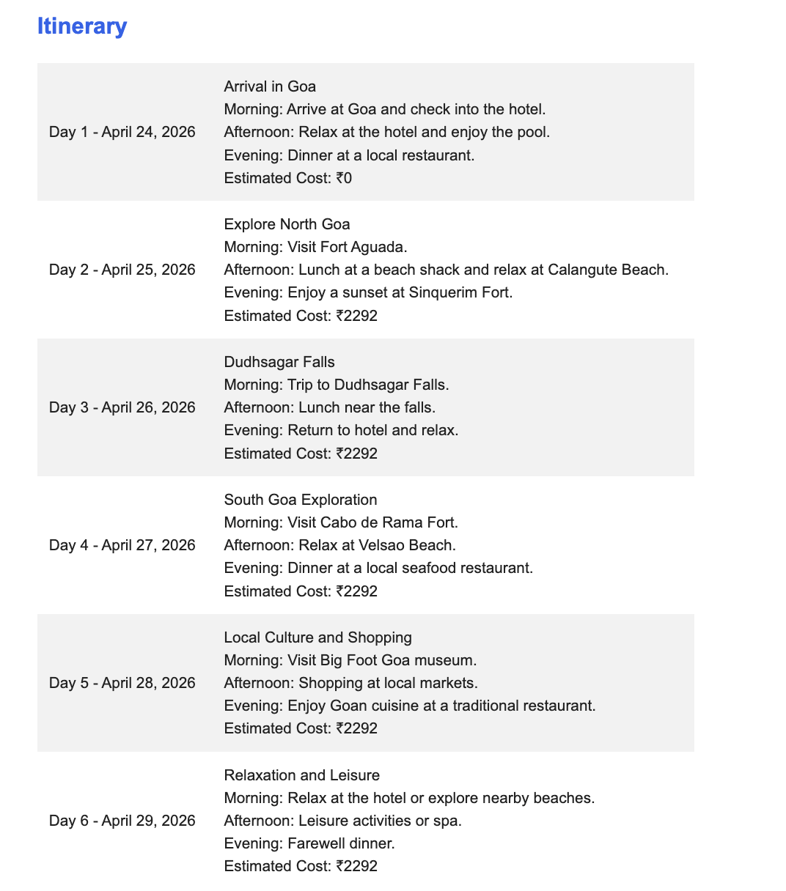
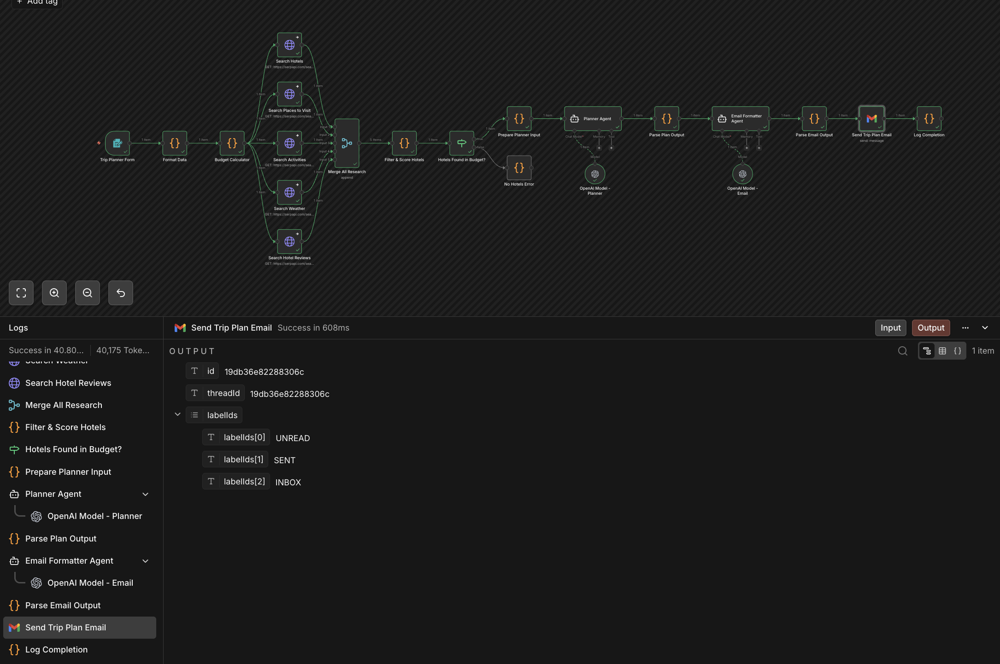

#  Trip Tadka — AI Trip Planner for n8n

> **Your personal AI travel agent** — just fill a form, and get a complete trip itinerary with hotels, activities, budget breakdown, and packing tips — delivered straight to your inbox! ✈️📧

[](https://n8n.io)
[](https://openai.com)
[](https://serpapi.com)
[](LICENSE)

---

##  Preview

###  Workflow Overview


###  Form Interface


###  Email Output
<p align="center">
  
  
</p>

###  Execution Log


---

## ✨ What It Does

Fill in a simple web form with your destination and email — Trip Tadka does the rest:

1. 🔍 **Researches** hotels, tourist spots, activities, weather & reviews in parallel
2. 🏨 **Scores & ranks** hotels using `rating × log₁₀(reviews)` algorithm
3. 📋 **Plans** a day-by-day itinerary with GPT-4o
4. 📧 **Emails** you a beautiful, responsive HTML itinerary

All within your budget. All automated. Zero manual work.

---

## Architecture

```
 Form Input
    │
    ▼
 Format Data ──→ Budget Calculator
                        │
         ┌──────────────┼──────────────┐──────────────┐──────────────┐
         ▼              ▼              ▼              ▼              ▼
      Hotels        Places       Activities       Weather        Reviews
         │              │              │              │              │
         └──────────────┴──────────────┴──────────────┴──────────────┘
                                       │
                                       ▼
                                 Merge & Score
                                       │
                                       ▼
                                Hotels in Budget?
                              ╱                ╲
                            Yes                No
                             │                 │
                             ▼                 ▼
                        AI Planner        Error Log
                             │
                             ▼
                        Email Agent
                             │
                             ▼
                        Gmail Send
                             │
                             ▼
                        Log Completion
```

**27 nodes** | **6 stages** | **5 parallel API calls** | **2 AI agents**

---

##  Node Breakdown

| Stage | Node | Type | Purpose |
|-------|------|------|---------|
|  **Input** | Trip Planner Form | Form Trigger | 9-field web form (only 2 required) |
| **Defaults** | Format Data | Code | Smart defaults + assumption tracking |
| | Budget Calculator | Code | 40/25/20/10/5% budget split |
|  **Research** | Search Hotels | HTTP Request | SerpAPI Google Hotels engine |
| | Search Places to Visit | HTTP Request | SerpAPI Google Maps engine |
| | Search Activities | HTTP Request | SerpAPI Google Search engine |
| | Search Weather | HTTP Request | SerpAPI weather forecast |
| | Search Hotel Reviews | HTTP Request | SerpAPI hotel reviews |
|  **Analyze** | Merge All Research | Merge | Combines 5 parallel streams |
| | Filter & Score Hotels | Code | Scores: `rating × log₁₀(reviews+1)` |
| | Hotels Found in Budget? | IF | Routes to planner or error |
|  **Plan** | Planner Agent | AI Agent | GPT-4o generates full trip JSON |
| | Parse Plan Output | Code | 4-step JSON extraction fallback |
|  **Email** | Email Formatter Agent | AI Agent | GPT-4o creates HTML email |
| | Parse Email Output | Code | Extracts subject + body safely |
| | Send Trip Plan Email | Gmail | Sends premium HTML itinerary |
| | Log Completion | Code | Records execution summary |

---

##  Quick Setup (5 minutes)

### Prerequisites

| Service | What You Need | Get It Here |
|---------|--------------|-------------|
| **n8n** | Cloud or self-hosted instance | [n8n.io](https://n8n.io) |
| **OpenAI** | API key with GPT-4o access | [platform.openai.com](https://platform.openai.com/api-keys) |
| **SerpAPI** | API key (100 free searches/month) | [serpapi.com](https://serpapi.com/manage-api-key) |
| **Gmail** | Google account for OAuth2 | [Google Cloud Console](https://console.cloud.google.com) |

### Step-by-Step

####  Import the Workflow

```bash
# Clone this repo
git clone https://github.com/prabh505/trip-tadka.git
```

- Open your **n8n instance**
- Go to **Workflows** → Click **⋮** (menu) → **Import from File**
- Select `trip_planner_workflow.json`
- The workflow will appear with all 27 nodes connected *(see [Workflow screenshot](#%EF%B8%8F-workflow-overview))*

####  Add Your SerpAPI Key

>  **IMPORTANT:** The workflow will NOT work without a valid SerpAPI key. Get one free at [serpapi.com](https://serpapi.com/manage-api-key) (100 searches/month on the free plan).

The workflow has a placeholder `insert_serpapi_key` in **5 HTTP Request nodes**. You must replace it with your actual SerpAPI key in each one:

1. Click on **Search Hotels** node → Scroll to Query Parameters → Find `api_key` → Replace `insert_serpapi_key` with your key
2. Click on **Search Places to Visit** node → Same step
3. Click on **Search Activities** node → Same step
4. Click on **Search Weather** node → Same step
5. Click on **Search Hotel Reviews** node → Same step

>  **Tip:** Use `Ctrl+H` / `Cmd+H` in the n8n editor to find & replace `insert_serpapi_key` across all nodes at once — much faster!

####  Set Up OpenAI Credentials

1. Go to **Settings** → **Credentials** → **Add Credential**
2. Search for **OpenAI API**
3. Paste your API key and save
4. Open **OpenAI Model - Planner** node → Select your credential
5. Open **OpenAI Model - Email** node → Select the same credential

####  Set Up Gmail Credentials

1. Go to **Settings** → **Credentials** → **Add Credential**
2. Search for **Gmail OAuth2**
3. Follow the OAuth flow to connect your Google account
4. Open **Send Trip Plan Email** node → Select your Gmail credential

####  Activate & Test!

1. Toggle the workflow **Active** 
2. Copy the **Form URL** from the Trip Planner Form node
3. Open it in your browser
4. Fill in **Destination** and **Email** (minimum required)
5. Submit and check your inbox! 📬

---

## Form Fields

| Field | Required | Default if Blank |
|-------|----------|-----------------|
| **Destination** |  Yes | — |
| Check-in Date |  No | Next Saturday |
| Check-out Date |  No | Next Sunday |
| Total Budget |  No | ₹55,000 |
| Currency |  No | INR |
| Number of Travelers |  No | 2 |
| **Your Email** |  Yes | — |
| Preferences |  No | Sightseeing, local food |
| Trip Type |  No | Leisure |

>  Only **Destination** and **Email** are required! Everything else has smart defaults. All assumptions are tracked and shown in the final email.

---

##  Smart Features

###  Smart Defaults
Leave fields blank and the system intelligently fills them:
- **Dates** → Next Saturday–Sunday (auto-calculated)
- **Budget** → ₹55,000 (₹50k–60k range)
- **Currency** → INR (always, unless changed)
- All assumptions are listed in the email under a blue info box

###  Hotel Scoring Algorithm
Hotels are ranked using a weighted score:
```
score = rating × log₁₀(reviews + 1)
```
This balances **quality** (rating) with **reliability** (review count), preventing hotels with a single 5-star review from ranking above a 4.5-star hotel with 2000 reviews.

###  Bulletproof JSON Parsing
AI agents sometimes return malformed JSON. Our Code-based parsers use a **4-step fallback**:
1. Direct `JSON.parse()`
2. Strip markdown ` ```json ``` ` fences → parse
3. Regex extract outermost `{ }` → parse
4. Fallback with safe defaults

###  Error Resilience
All 5 HTTP research nodes use `continueOnError` — if one API call fails, the rest continue normally.

---

##  Email Preview

The email includes:
-  **Hotel recommendations** with ratings, prices & amenities
-  **Day-by-day itinerary** (morning/afternoon/evening)
-  **Budget breakdown** table
-  **Weather info** & packing tips
-  **Local travel tips**
-  **Assumptions box** (if smart defaults were used)

Designed with a modern color scheme:
- Header gradient: `#2563EB → #7C3AED`
- Accent: `#10B981` (green)
- Max-width 600px, all inline CSS

---

##  API Costs

| Service | Cost per Trip | Notes |
|---------|--------------|-------|
| SerpAPI | 5 searches (~$0.025) | 100 free/month on free tier |
| OpenAI GPT-4o | ~$0.03–0.08 | 2 agent calls (planner + email) |
| Gmail | Free | OAuth2, no limits |
| **Total** | **~$0.05–0.10/trip** | |

---

## Troubleshooting

| Issue | Solution |
|-------|----------|
| `Missing check_in_date` error | Form field names vary by n8n version — the `findVal()` function in Format Data handles this. Ensure you're on n8n v1.40+ |
| No hotels found | Increase budget or try different dates (off-season) |
| Email not received | Check Gmail credential, check spam folder |
| AI returns malformed JSON | Parse Code nodes have 4-step fallback — check execution logs for `parse_error: true` |
| Merge node shows 2 inputs | Ensure `numberInputs: 5` is set in Merge node parameters |

---

##  Project Structure

```
 trip-tadka/
├──  trip_planner_workflow.json   # n8n workflow (import this)
├──  README.md                    # You're reading this
├──  assets/                      # Screenshots & previews
│   ├──  Workflow.png             # Full workflow view
│   ├──  Form.png                 # Form trigger interface
│   ├──  Execution.png            # Execution log
│   ├──  Mail1.png                # Email output (part 1)
│   └──  Mail2.png                # Email output (part 2)
└──  LICENSE                      # MIT License
```

---

##  Contributing

1. Fork the repository
2. Import `trip_planner_workflow.json` into your n8n instance
3. Make improvements
4. Export the updated workflow as JSON
5. Submit a Pull Request

---

##  License

This project is licensed under the MIT License — see the [LICENSE](LICENSE) file for details.

---

##  Credits

- **[n8n](https://n8n.io)** — Workflow automation platform
- **[OpenAI GPT-4o](https://openai.com)** — AI planning & email formatting
- **[SerpAPI](https://serpapi.com)** — Google Hotels, Maps & Search API
- **[Gmail API](https://developers.google.com/gmail)** — Email delivery

---

<div align="center">

**Made by [Prabhpreet Singh](https://github.com/prabh505)**


</div>
